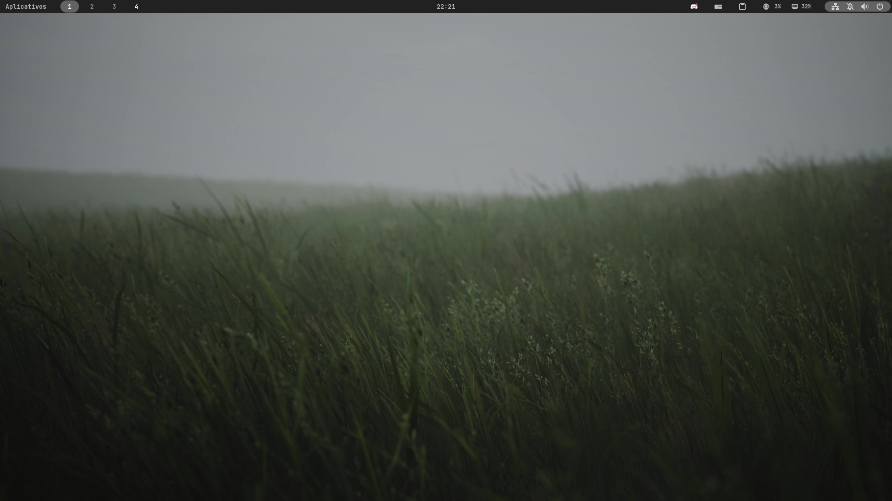

# MY FEDORA RICE

**my configs:**
- Sistem: Fedora
- Terminal: Kitty
- Editor: Neovim
- Theme: GruvBox
- Desktop: Gnome

**extensions:**
- Blur my shell
- Burn my windows
- Just perfection
- Clipboard Indicator
- Dash to Dock
- Search Light
- Space Bar
- System monitor
- User Themes
- Top Bar Organizer
- pop-shell (for tiling window manager)

